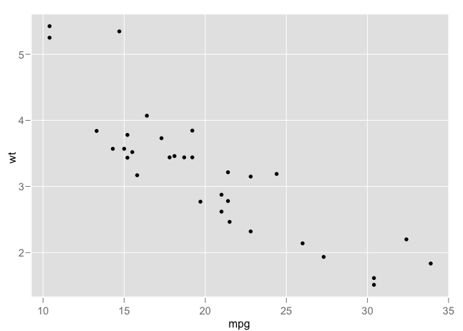
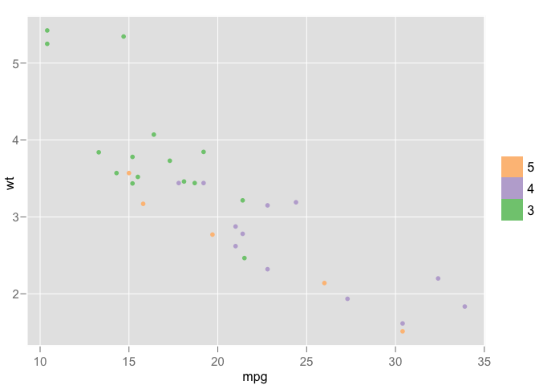

<!-- README.md is generated from README.Rmd. Please edit that file -->

# ggplot1

<!-- badges: start -->

[](https://github.com/hadley/ggplot1/actions/workflows/R-CMD-check.yaml)
<!-- badges: end -->

ggplot1 is an update of ggplot, the package that preceded ggplot2.
ggplot1 is mostly made available out of historical interest, to
illustrate how my thinking about API design in R has evolved over the
years. I’ve made a few minor tweaks to the package, mostly fixing small
things that obscure the interesting parts of the API.

ggplot had 7 CRAN releases starting with 0.2.2 in April 2006, and
finishing with 0.4.2 in October 2008.

## Installation

You can install ggplot1 from github with:

``` r
# install.packages("devtools")
devtools::install_github("hadley/ggplot1")
```

## Usage

``` r
library(ggplot1)

mtcars |>
  ggplot(list(x = mpg, y = wt)) |>
  ggpoint()
```



``` r

mtcars |>
  ggplot(list(x = mpg, y = wt)) |>
  ggpoint(list(colour = gear)) |>
  scbrewer()
```


